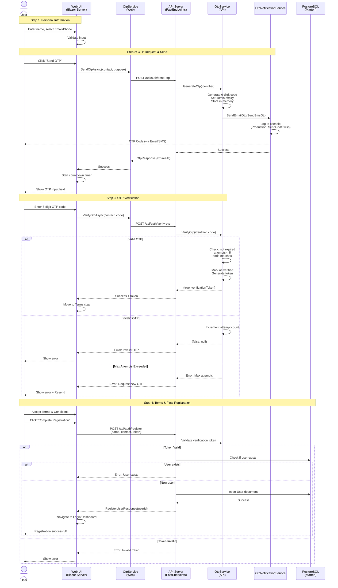
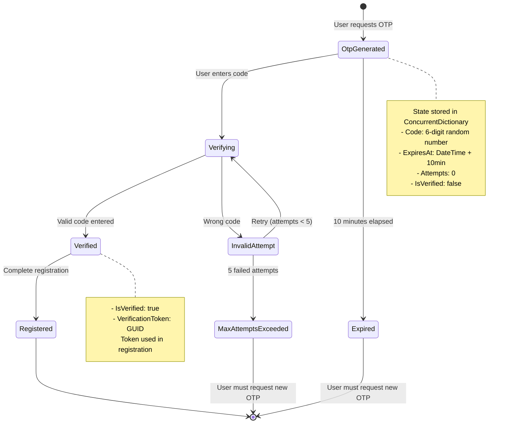
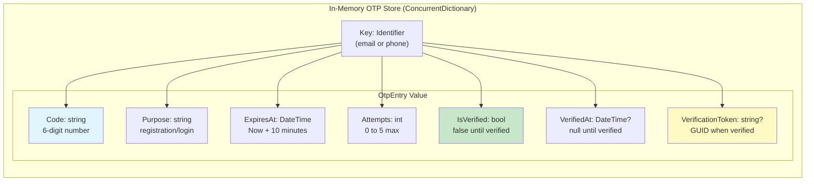
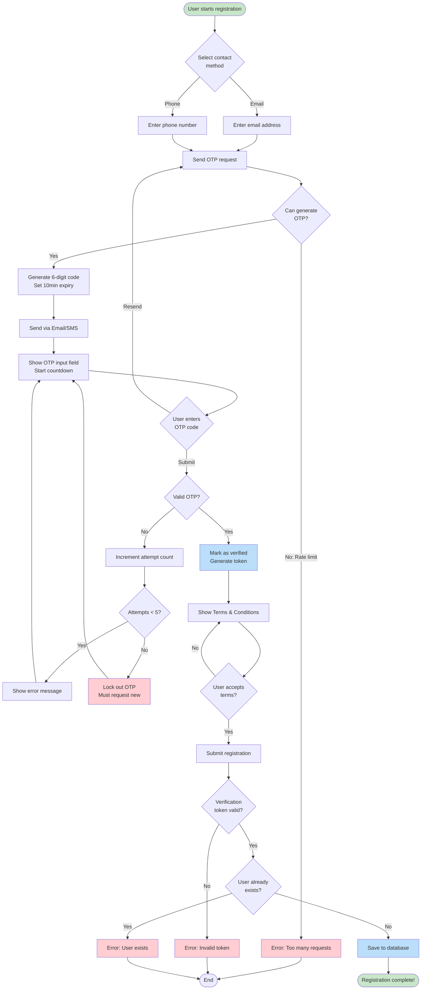
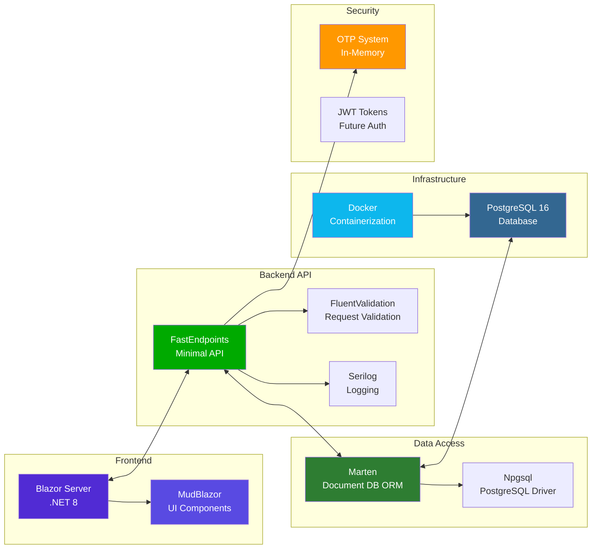
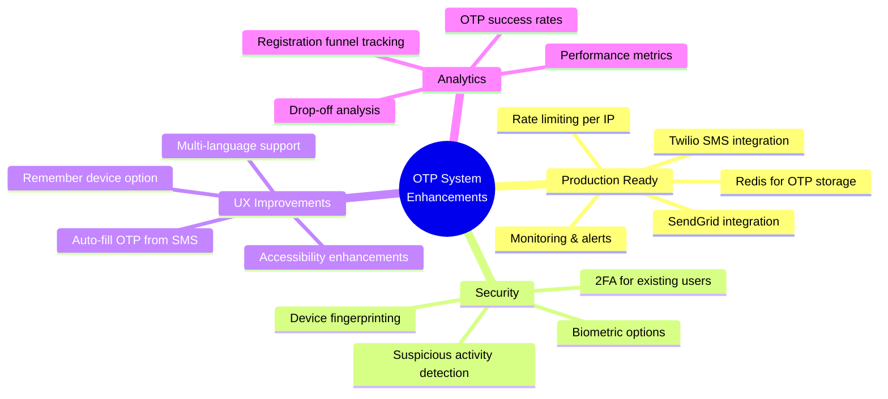

# BookingScheduleSystem - System Workflows

## User Registration Flow with OTP Verification



## System Architecture Overview

```mermaid
graph TB
    subgraph "Client Layer"
        Browser[Web Browser]
    end

    subgraph "Web Application - BookingScheduleSystem.Web"
        BlazorApp[Blazor Server App<br/>Port: 5288]
        WebServices[Services]
        OtpWebService[OtpService]
        WebServices --> OtpWebService
    end

    subgraph "API Layer - BookingScheduleSystem.Api"
        APIServer[API Server<br/>Port: 5059]

        subgraph "FastEndpoints"
            SendOtpEP[/api/auth/send-otp]
            VerifyOtpEP[/api/auth/verify-otp]
            RegisterEP[/api/auth/register]
        end

        subgraph "Infrastructure Services"
            OtpSvc[OtpService<br/>In-Memory Store]
            NotifSvc[OtpNotificationService<br/>Email/SMS]
        end

        APIServer --> SendOtpEP
        APIServer --> VerifyOtpEP
        APIServer --> RegisterEP
        SendOtpEP --> OtpSvc
        VerifyOtpEP --> OtpSvc
        OtpSvc --> NotifSvc
    end

    subgraph "Data Layer"
        PostgreSQL[(PostgreSQL<br/>Database<br/>Port: 5432)]
        Marten[Marten ORM<br/>Document Store]
        PostgreSQL --> Marten
    end

    subgraph "Infrastructure"
        Docker[Docker Container<br/>bookingschedule_postgres]
        Docker --> PostgreSQL
    end

    Browser <-->|HTTP| BlazorApp
    BlazorApp <-->|REST API| APIServer
    APIServer <-->|Npgsql| Marten
    NotifSvc -.->|Future: SendGrid| Email[Email Service]
    NotifSvc -.->|Future: Twilio| SMS[SMS Service]

    style OtpSvc fill:#e1f5ff
    style OtpWebService fill:#e1f5ff
    style NotifSvc fill:#fff4e1
    style PostgreSQL fill:#336791,color:#fff
    style Docker fill:#0db7ed,color:#fff
```

## OTP Service Internal State Management



## Data Flow - OTP Storage Structure



## Registration Flow - Decision Tree



## Technology Stack



## Future Enhancements



---

## Notes

### Current Implementation (Development)
- **OTP Storage**: In-memory `ConcurrentDictionary` (not production-ready)
- **Notifications**: Console logging only
- **Security**: Basic validation (10min expiry, 5 max attempts)

### Production Recommendations
1. **OTP Storage**: Migrate to Redis with TTL
2. **Email**: Integrate SendGrid with templates
3. **SMS**: Integrate Twilio or Semaphore SMS
4. **Rate Limiting**: Add per-IP and per-user limits
5. **Monitoring**: Add logging for security events
6. **Backup**: Secondary verification method

### Key Security Features Implemented
✅ Time-limited OTP (10 minutes)
✅ Maximum attempt limit (5 attempts)
✅ Verification token for registration
✅ Purpose-specific OTP codes
✅ Secure random number generation

### Next Steps
1. Test complete registration flow
2. Add email/SMS provider integration
3. Implement user login with OTP
4. Add password-based login option
5. Build dashboard for authenticated users
